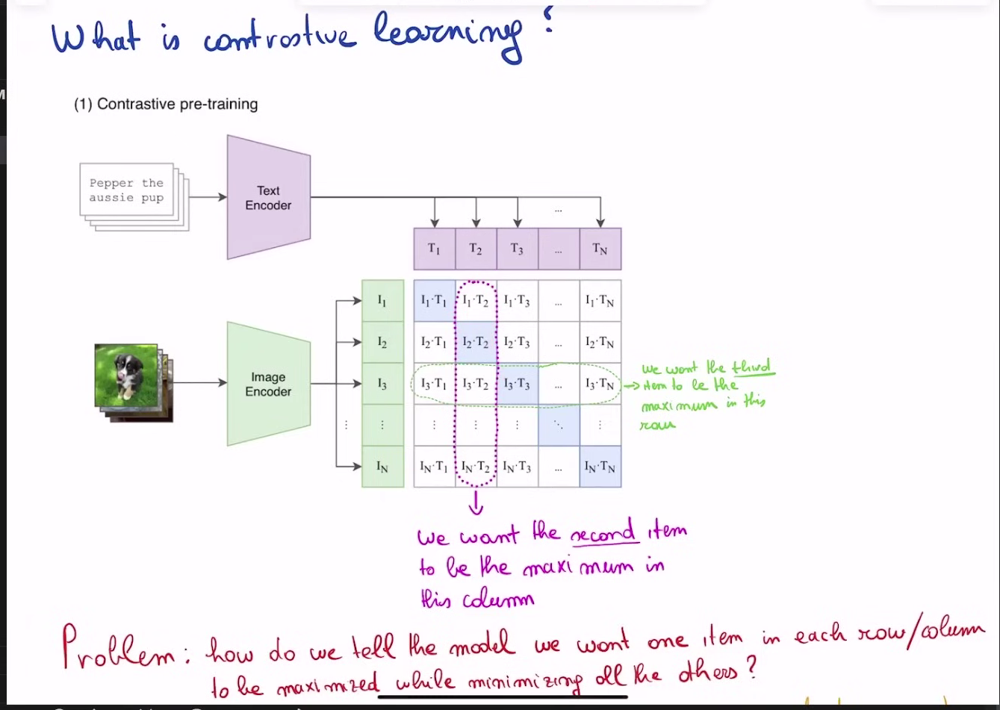
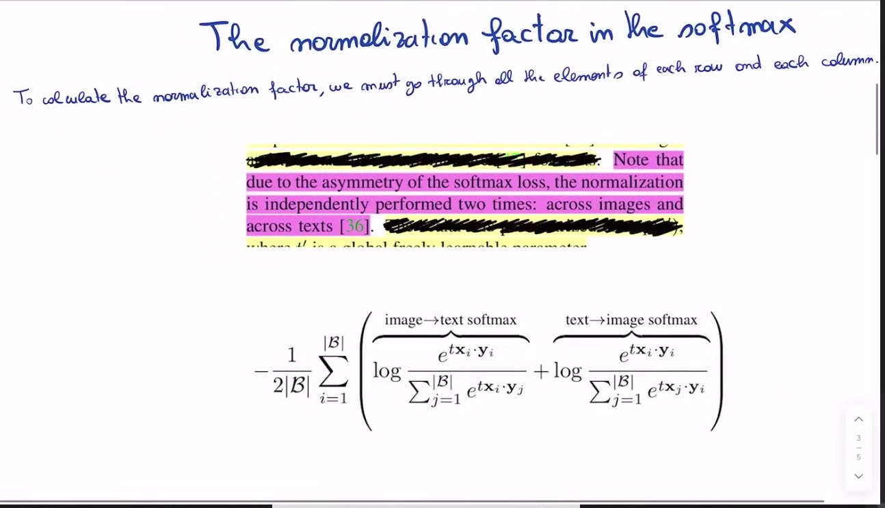

## 1. Contrastive Learning
### What is contrastive learning?

Text -> Text Encoder -> text embeddings

Image -> Image Encoder -> image embeddings

In contrastive learning we train our model-encoder such that the when we do the dot product of corresponding text and image it should have a higher value on contrast we the non-corresponding text and image should give least value in dot product.

The loss function is Cross entropy loss.



```python
I_f = img_encoder(I) # [n,d_i]
T_f = text_encoder(T) # [n,d_t]

I_e = l2_normalize(np.dot(I_f,W_i),axis = 1) # [n,d_e]
T_e = l2_normalize(np.dot(T_f,W_t),axis = 1) # [n,d_e]

logits = np.dot(I_e,T_e)*np.exp(t)

labels = np.arange(n)
loss_i = cross_entropy_loss(logits,labels,axis=0) 
# For each row (each image), "Which text matches this image?"
loss_t = cross_entropy_loss(logits,labels,axis=1)
# For each row (each text), "Which image matches this text?"

loss = (loss_i+loss_t)/2
```

## 2. Numerical Stability of Softmax

$$\large{\text{Softmax function: }S_i = \frac{e^{a_i}}{\sum_{k=1}^{N}{e^{a_k}}}}$$

- If the $a_i$ is too high then it is a problem so we need to fix this.

- Solution: $$\large{\text{Softmax function: }S_i = \frac{c.e^{a_i}}{c.\sum_{k=1}^{N}{e^{a_k}}}} = \frac{e^{log(c)}.e^{a_i}}{e^{log(c)}.\sum_{k=1}^{N}{e^{a_k}}} = \frac{e^{{log(c)}+a_i}}{\sum_{k=1}^{N}{e^{{log(c)}+a_k}}}$$

- $log(c) = -max(a_i)$ 




## 3. Why we need to change the loss function
if we use the cross entropy loss then it is computationally expensive so instead of cross entropy loss we choose sigmoid.

$$\large{\frac{1}{|\beta|}\sum_{i=1}^{|\beta|}\sum_{j=1}^{|\beta|}log\frac{1}{1+e^{z_{ij}(-tx_{i}.y_{j}+b)}}}$$

here instead of treating all the dot product inclusively we treated them independently and do the binary classification task where we do $I_i.T_j$ should be 0 or 1 

## 4. Vision Transformer

